# Wi-Fi CSI 기반 행동 인식에서 학습 데이터 절감 가능성 분석

## 초록

본 프로젝트는 `UT-HAR` 데이터셋을 이용해 Wi-Fi CSI 기반 Human Activity Recognition(HAR)에서 전처리와 모델 선택을 통해 적은 학습 데이터로도 성능을 어느 정도 유지할 수 있는지를 분석하였다. 이를 위해 F1 `original benchmark`, F2 전처리 비교, F3 multi-seed stability check, F4 low-data robustness, F5 augmentation recovery의 순차적 workflow를 구성하고, 각 단계의 결과를 다음 단계의 입력으로 사용하였다. 최종 전처리는 `moving_average_smoothing+minmax_scaling`으로 선택되었으며, 이 선택은 single-seed 결과가 아니라 seed `42, 43, 44`에 대한 mean validation `Macro F1` 기준으로 확정하였다.

실험 결과, F1 benchmark에서 `ResNet18`이 validation `Macro F1` 기준 rank 1을 차지했고, F3에서는 `moving_average_smoothing+minmax_scaling`이 mean validation `Macro F1 = 0.9268`, mean test `Macro F1 = 0.9118`을 기록하며 최종 전처리로 선정되었다. F4 low-data robustness에서는 같은 전처리 조건에서 `ResNet18`이 `real_ratio=0.25`에서 test `Macro F1 = 0.9008`, test `Accuracy = 0.9400`을 달성해 상대적으로 강한 성능 유지력을 보였고, `real_ratio=0.1`에서도 test `Macro F1 = 0.7543`으로 top3 중 가장 안정적이었다. 반면 F5 augmentation recovery에서는 현재 train-only augmentation policy가 성능을 일관되게 회복시키지 못했고, `9`개 model/ratio 조합 중 `7`개에서 `augmentation_gain_macro_f1`가 음수로 나타났다.

## 1. 연구 배경 및 문제 정의

### 1.1 고령화와 돌봄 공백

한국은 빠른 속도로 고령사회에서 초고령사회로 이동하고 있다. 통계청 장래인구추계 기준 65세 이상 인구 비중은 `2025년 20.3%`, `2036년 30.9%`, `2050년 40% 초과`로 전망된다. 이러한 변화는 단순한 인구 구조 변화에 그치지 않고, 일상 돌봄 수요와 안전 모니터링 수요의 증가로 직접 연결된다.

동시에 고령화는 생산가능인구 비중의 상대적 축소를 동반하므로, 돌봄 수요 증가를 기존 인력 중심 방식만으로 감당하기 어렵다. 특히 1인 고령가구 증가와 사회적 고립 문제는 돌봄 공백을 심화시킬 수 있다. 보건복지부 발표 기준 `2024년 고독사 사망자는 3,924명`으로 `2023년 대비 증가`하였으며, 이는 단순한 복지 문제가 아니라 조기 탐지와 생활 안전 관리 체계의 필요성을 보여주는 사회적 신호로 해석할 수 있다.

따라서 고령층의 일상 활동, 이상 행동, 낙상 가능성을 보다 지속적으로 파악할 수 있는 비침습적이고 현실적인 감지 기술이 중요해지고 있다.

### 1.2 기존 모니터링 방식의 한계

기존 모니터링 방식은 크게 camera 기반, 사용자 확인 기반, 인력 기반 방식으로 나눌 수 있다. Camera 기반 방식은 정보량이 풍부해 낙상이나 이상행동을 세밀하게 감지할 가능성이 높지만, 사생활 침해 우려와 해킹 위험 때문에 실제 가정 환경에서 수용성이 낮을 수 있다. 침실, 거실, 화장실과 같은 생활 공간에서는 이러한 우려가 특히 크게 작용한다.

버튼 호출, 정기 응답 확인, 주기적 manual check 방식은 비교적 단순하게 도입할 수 있지만, 사용자의 지속적인 협조가 필요하다는 한계가 있다. 특히 응급 상황에서 사용자가 직접 반응하지 못하거나 의식을 잃은 경우에는 시스템이 제 역할을 하지 못할 수 있다. 인력 기반 상시 모니터링 역시 비용 부담이 크고, 앞서 언급한 돌봄 인력 제약 때문에 확장성이 제한된다.

### 1.3 Wi-Fi CSI의 가능성

Wi-Fi CSI(Channel State Information)는 무선 신호가 공간을 통과하는 과정에서 사람의 움직임, 자세 변화, 다중경로 변화에 따라 달라지는 특성을 담는다. 즉, 사람이 이동하거나 자세를 바꾸면 전파 경로가 달라지고, 그 변화가 CSI 패턴에 반영된다. 이를 이용하면 카메라처럼 사람의 외형을 직접 촬영하지 않고도 행동 패턴을 감지할 가능성이 있다.

이러한 특성 때문에 Wi-Fi CSI 기반 HAR는 privacy-friendly한 대안으로 주목받는다. 특히 낙상, 보행, 앉기/일어서기 같은 활동을 이미지 없이 감지할 수 있다는 점은 고령자 돌봄 환경에서 중요한 장점이다. 다만 Wi-Fi CSI HAR는 본질적으로 환경 민감성이 크다. 공간 구조, 벽체 재질, 가구 배치, 송수신기 위치, 사용자 체형, 신호 잡음 조건에 따라 성능이 크게 달라질 수 있으며, 동일한 모델이라도 설치 장소가 바뀌면 일반화 성능이 유지되지 않을 수 있다.

### 1.4 본 연구의 핵심 목표

실제 배치 환경에서는 household 또는 site 단위의 calibration/training이 필요할 가능성이 높다. 따라서 중요한 질문은 “새로운 환경에 적응하기 위해 얼마나 많은 labeled training data가 필요한가”이다. 본 연구는 이 문제를 학습 데이터 절감 관점에서 다룬다. 연구의 핵심 질문은 다음과 같다.

> **Wi-Fi CSI 기반 HAR에서 전처리와 모델 선택을 통해 적은 학습 데이터로도 행동 인식 성능을 어느 정도 유지할 수 있는가?**

부가적으로 다음 질문도 함께 다룬다.

> **Data augmentation이 low-data 상황에서 성능 회복에 도움이 되는가?**

`real_ratio`는 train split에서 실제 사용하는 표본 비율을 의미한다. 이를 calibration time reduction의 잠재적 지표로 해석할 수는 있지만, 이는 엄밀한 실제 시간 측정이 아니라 frame count 기반 단순 환산에 가깝다. 본 프로젝트에서 한 sample은 `250 CSI frame indices`로 구성되므로, 만약 `sampling_rate = 100Hz`라고 가정하면 sample당 약 `2.5s`, `50Hz`라면 약 `5s`에 해당한다. 다만 이는 illustrative estimate일 뿐이며, 데이터셋의 실제 sampling rate가 본 프로젝트에서 확인된 것은 아니다.

이를 바탕으로 train sample 수를 대략적인 frame-duration으로 환산하면 다음과 같다.

| train ratio | sample 수 | 100Hz 가정 | 50Hz 가정 |
|---|---:|---:|---:|
| 100% | 3977 | `3977 x 250 / 100 = 9942.5s` 약 `165.7분` | `3977 x 250 / 50 = 19885s` 약 `331.4분` |
| 25% | 992 | `992 x 250 / 100 = 2480s` 약 `41.3분` | `992 x 250 / 50 = 4960s` 약 `82.7분` |
| 10% | 395 | `395 x 250 / 100 = 987.5s` 약 `16.5분` | `395 x 250 / 50 = 1975s` 약 `32.9분` |

이는 연속 수집 시간의 엄밀한 측정이 아니라 frame count 기반 단순 환산이다. 그럼에도 불구하고, low-data 실험 결과를 실제 설치 후 초기 calibration 부담과 연결해 해석하는 데에는 유용한 직관을 제공한다.

## 2. 데이터셋 및 입력 구조

본 연구는 `UT-HAR` 데이터셋을 사용하였다. 본 프로젝트에서 입력은 `(N, 250, 90)` shape의 array로 로드되며, 각 sample은 `250 CSI frame indices x 90 CSI features`로 구성된다. `90`차원 feature는 문헌적 해석으로는 `30 subcarriers x 3 antenna pairs`에 대응할 가능성이 있으나, 본 보고서에서는 보수적으로 “90차원 CSI feature”로 기술한다.

행동 label은 다음 7개 클래스이다.

- `lie down`
- `fall`
- `walk`
- `pickup`
- `run`
- `sit down`
- `stand up`

중요한 점은 timestep이 초 단위 시간이 아니라 `CSI frame index`라는 점이다. 따라서 시간 축 해석에는 sampling rate 정보가 필요하며, 본 보고서의 초 단위 환산은 어디까지나 illustrative assumption이다.

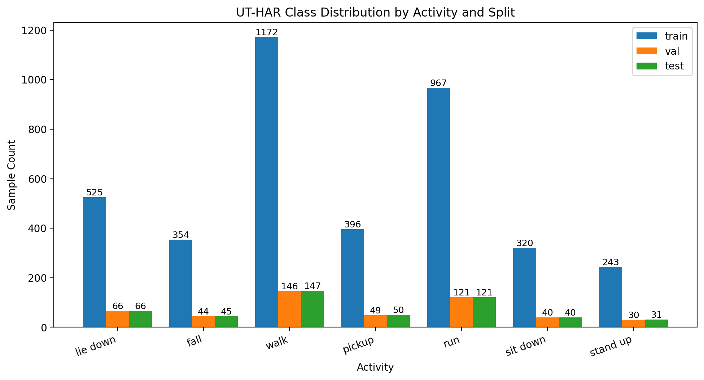

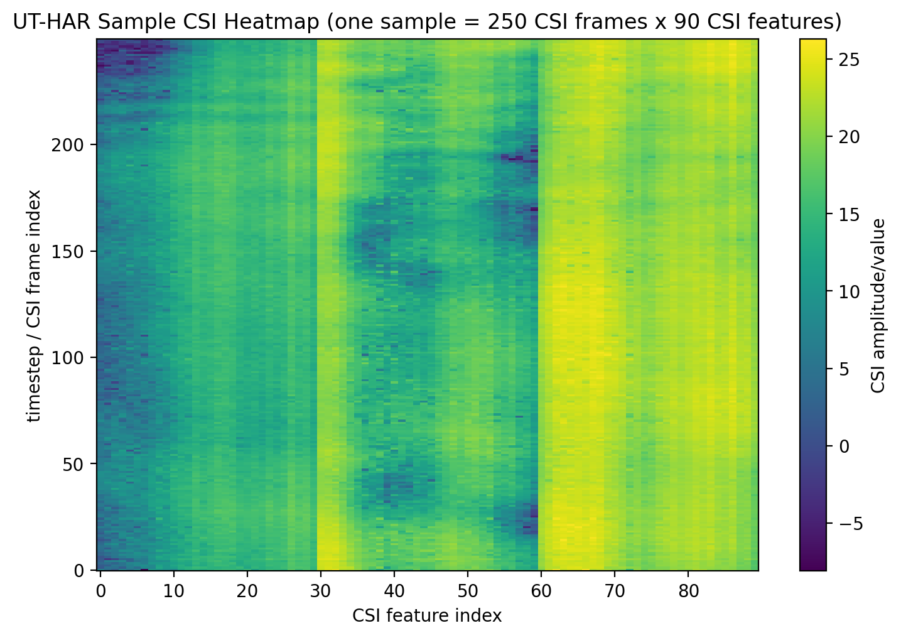

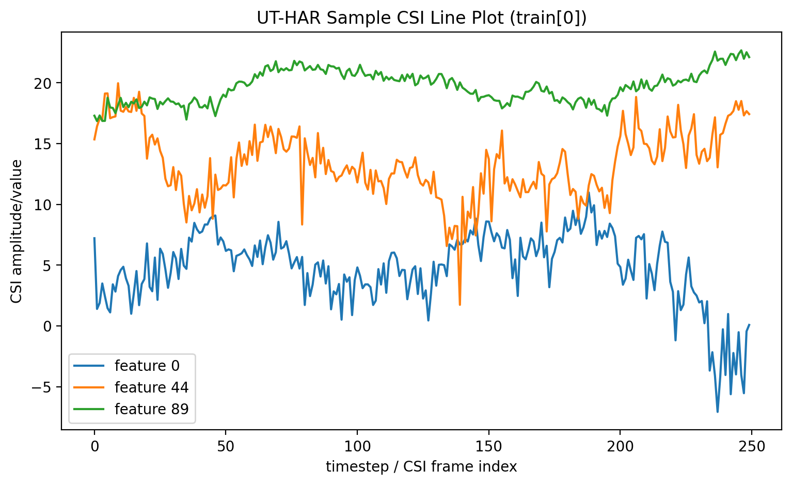

## 3. 실험 설계

### 3.1 전체 실험 흐름

전체 실험은 F1부터 F5까지 순차적으로 설계하였다.

- **F1**: `preprocessing=none/raw` 조건에서 original benchmark-compatible model들을 비교하였다.
- **F2**: F1에서 선택된 benchmark rank 1 model을 사용해 전처리 후보를 비교하였다.
- **F3**: F2에서 근접한 후보들이 존재했기 때문에 multi-seed stability check를 수행하여 최종 전처리를 확정하였다.
- **F4**: 최종 전처리를 고정한 뒤 benchmark top3 model에 대해 low-data robustness를 평가하였다.
- **F5**: F4 no-augmentation baseline을 기준으로 train-only augmentation recovery를 평가하였다.

이 구조는 결과 해석의 일관성을 위해 중요하다. F1은 모델 선택, F2/F3는 전처리 선택, F4는 low-data robustness, F5는 augmentation effect 평가로 역할을 분리하였다.

### 3.2 평가 지표

주요 평가 지표는 `Accuracy`와 `Macro F1`이다. 이 중 최종 모델/전처리 선택에는 `Macro F1`을 우선적으로 사용하였다. `Macro F1`은 클래스별 성능을 균형 있게 반영하기 때문에, 일부 클래스만 잘 맞추는 모델보다 전체 행동 클래스에 대해 고르게 성능을 유지하는 모델을 선별하는 데 더 적합하다. `Accuracy`는 전체적인 정답률을 보여주는 보조 지표로 활용하였다.

### 3.3 학습 데이터 축소 방식

`real_ratio`는 train split에만 적용되며, validation/test split은 그대로 유지하였다. 따라서 low-data 실험은 평가 세트 축소가 아니라 train data availability 감소에 대한 민감도 분석이다. train subset은 deterministic `stratified sampling`으로 구성하여 클래스 분포 왜곡을 최소화하였다.

또한 `seed 42, 43, 44`는 train/validation/test를 새로 3등분한 것이 아니라 동일 실험을 다른 랜덤 조건으로 반복해 안정성을 확인하기 위한 설정이다. 즉, 이는 K-fold cross validation이 아니라 subset sampling, weight initialization, shuffle 조건 변화에 대한 robustness check로 이해해야 한다.

## 4. 모델 Benchmark 결과

F1 benchmark에서는 validation `Macro F1`을 기준으로 모델을 정렬하였고, test `Macro F1`은 confirmation only로 사용하였다. 그 결과 benchmark rank 1 model은 `ResNet18`이었다. top3는 `ResNet18`, `LeNet`, `ResNet101`이며, top5까지 확장하면 `ResNet50`, `ViT`가 뒤를 이었다.

| rank | model | val_macro_f1 | test_macro_f1 | val_accuracy | test_accuracy |
|---:|---|---:|---:|---:|---:|
| 1 | ResNet18 | 0.9906 | 0.9807 | 0.9940 | 0.9880 |
| 2 | LeNet | 0.9887 | 0.9672 | 0.9940 | 0.9780 |
| 3 | ResNet101 | 0.9776 | 0.9230 | 0.9819 | 0.9500 |
| 4 | ResNet50 | 0.9773 | 0.9640 | 0.9798 | 0.9760 |
| 5 | ViT | 0.9707 | 0.9175 | 0.9738 | 0.9400 |

이 결과는 `ResNet18`이 UT-HAR benchmark setting에서 가장 높은 validation 기반 일반화 성능을 보였음을 의미한다. 따라서 이후 F2/F3 전처리 비교에는 `ResNet18`을 사용하였고, F4/F5에는 benchmark top3를 사용하였다.

## 5. 전처리 비교 및 최종 전처리 선택

### 5.1 전처리 후보

F2에서 비교한 전처리 후보는 다음과 같다.

- `none/raw`
- `train_global_zscore`
- `per_sample_zscore`
- `minmax_scaling`
- `robust_scaling`
- `savgol_smoothing`
- `moving_average_smoothing`
- `train_featurewise_zscore`
- `per_sample_featurewise_zscore`
- 그리고 일부 조합형 preprocessing

각 후보는 amplitude rescaling, outlier robustness, temporal smoothing이라는 서로 다른 가정을 반영한다. 특히 smoothing 계열은 고주파 잡음을 줄이는 효과를 기대할 수 있지만, 과도한 smoothing은 활동 패턴의 식별 정보를 흐릴 위험도 있다.

### 5.2 F2 single/combination 결과

F2 single-method comparison에서는 `train_featurewise_zscore`가 validation `Macro F1` 기준 가장 높은 성능을 보였다. 그러나 이것만으로 최종 전처리를 확정하지는 않았다. combination 결과에서는 `savgol_smoothing+train_global_zscore`와 `moving_average_smoothing+minmax_scaling` 등 근접한 후보가 나타났고, validation score 차이가 매우 작았다. 따라서 single-seed 결과만으로는 최종 선택 근거가 충분하지 않았다.

즉, F2는 후보군을 압축하는 단계였고, 최종 전처리 확정은 F3 stability check에서 수행하였다.

### 5.3 F3 multi-seed stability check

F3의 목적은 F2에서 근접했던 후보들의 seed 안정성을 확인하는 것이었다. 최종적으로 선택된 전처리는 `moving_average_smoothing+minmax_scaling`이며, 이는 seed `42, 43, 44`에서 다음 성능을 보였다.

- `mean_val_macro_f1 = 0.9268`
- `mean_test_macro_f1 = 0.9118`
- `seeds = 42, 43, 44`

이 단계에서 selection rule은 mean validation `Macro F1` 우선, stability는 meaningful tie-break only였다. 따라서 test `Macro F1`는 선택 기준이 아니라 confirmation에만 사용하였다.

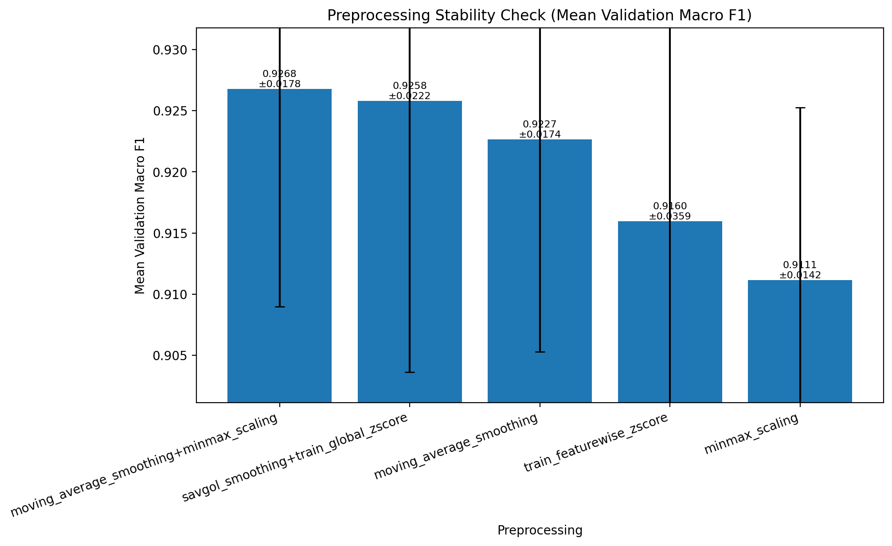

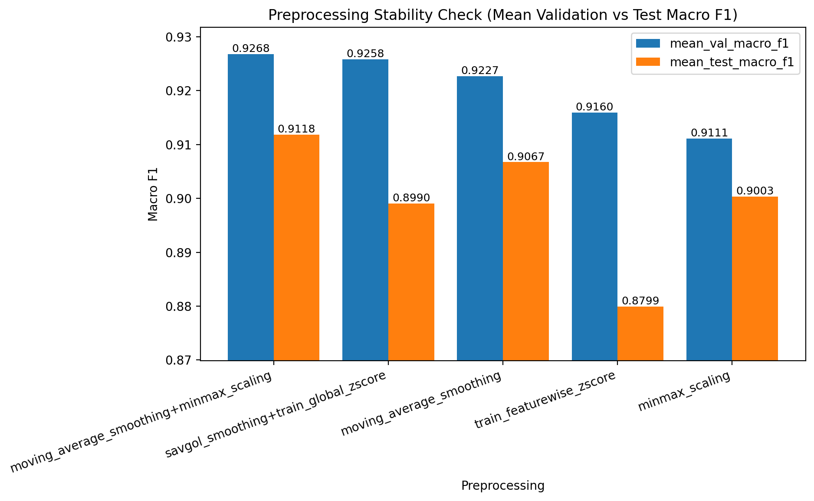

정리하면, 본 프로젝트의 final preprocessing은 `moving_average_smoothing+minmax_scaling`이다.

## 6. Low-data Robustness 결과

F4에서는 final preprocessing을 `moving_average_smoothing+minmax_scaling`으로 고정하고, benchmark top3인 `ResNet18`, `LeNet`, `ResNet101`에 대해 `real_ratio = 1.0, 0.5, 0.25, 0.1`을 비교하였다. 이 실험의 핵심 목적은 labeled train data가 줄어들 때 성능이 얼마나 유지되는지 보는 것이다.

| model | real_ratio | test_macro_f1 | test_accuracy | macro_f1_retention |
|---|---:|---:|---:|---:|
| LeNet | 1.00 | 0.9621 | 0.9740 | 1.0000 |
| LeNet | 0.50 | 0.9333 | 0.9540 | 0.9701 |
| LeNet | 0.25 | 0.8368 | 0.8840 | 0.8698 |
| LeNet | 0.10 | 0.0649 | 0.2940 | 0.0675 |
| ResNet101 | 1.00 | 0.9763 | 0.9800 | 1.0000 |
| ResNet101 | 0.50 | 0.9395 | 0.9560 | 0.9624 |
| ResNet101 | 0.25 | 0.8565 | 0.8980 | 0.8773 |
| ResNet101 | 0.10 | 0.7372 | 0.8060 | 0.7551 |
| ResNet18 | 1.00 | 0.9629 | 0.9740 | 1.0000 |
| ResNet18 | 0.50 | 0.9361 | 0.9600 | 0.9722 |
| ResNet18 | 0.25 | 0.9008 | 0.9400 | 0.9355 |
| ResNet18 | 0.10 | 0.7543 | 0.8160 | 0.7834 |

해석하면 다음과 같다.

- `real_ratio=0.5`에서는 benchmark top3 모두 비교적 안정적인 성능을 유지한다.
- `real_ratio=0.25`에서는 차이가 더 뚜렷해지며, `ResNet18`이 `test_macro_f1 = 0.9008`, `test_accuracy = 0.9400`, `macro_f1_retention = 0.9355`로 가장 강한 결과를 보였다.
- `real_ratio=0.1`에서도 `ResNet18`이 `test_macro_f1 = 0.7543`으로 가장 높은 성능을 유지했다.
- 반면 `LeNet`은 `real_ratio=0.1`에서 `test_macro_f1 = 0.0649`로 급격한 붕괴를 보였다.

이 결과는 “학습 데이터를 크게 줄이더라도 적절한 model/preprocessing 조합에서는 상당한 수준의 성능 유지가 가능하다”는 점을 시사한다. 특히 `ResNet18 + moving_average_smoothing+minmax_scaling` 조합은 practical low-data candidate로 해석할 수 있다.

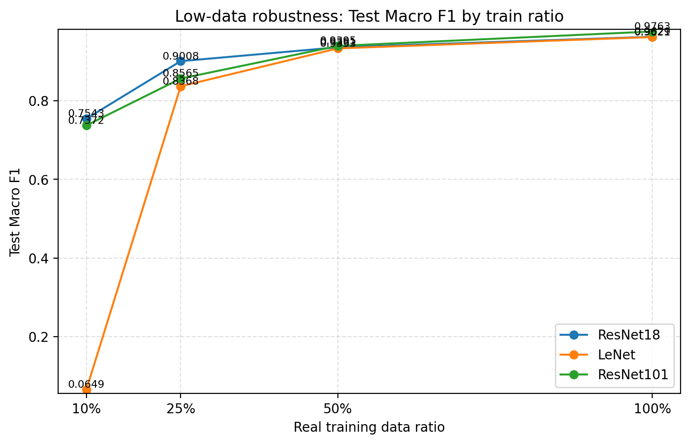

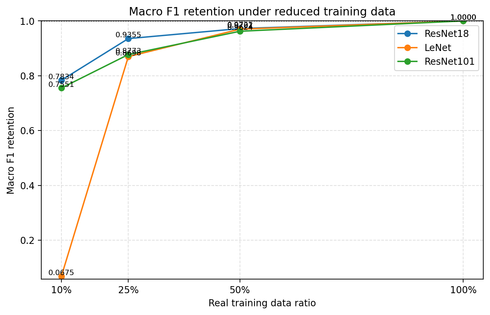

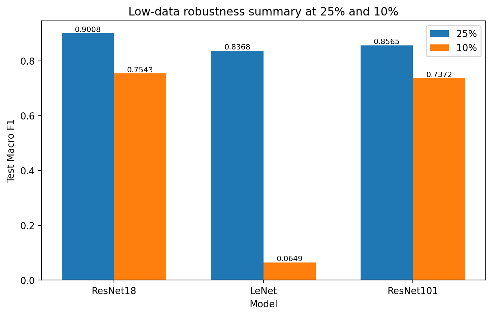

## 7. Data Augmentation Recovery 결과

F5의 목적은 low-data setting에서 train-only augmentation이 F4 no-augmentation baseline 대비 성능을 회복시킬 수 있는지 확인하는 것이었다. validation/test에는 augmentation을 적용하지 않았고, 비교 기준은 같은 model과 같은 `real_ratio`에서의 F4 결과이다.

결과적으로 `augmentation_gain_macro_f1`가 양수인 경우는 `2`개, 음수인 경우는 `7`개였다. 즉, 현재 augmentation policy는 전반적으로 성능을 일관되게 회복시키지 못했다.

세부적으로 보면 다음과 같다.

- 가장 큰 positive gain은 `LeNet` at `real_ratio=0.1`에서 `+0.0410`이었다.
- 그러나 이 경우 absolute test `Macro F1` 자체는 `0.1059`로 여전히 매우 낮다.
- 가장 큰 negative gain은 `ResNet101` at `real_ratio=0.1`에서 `-0.1549`였다.
- `ResNet18`은 `real_ratio=0.5`에서만 소폭 개선되었고, `0.25`와 `0.1`에서는 오히려 성능이 감소했다.
- `ResNet101`은 모든 low-data ratio에서 augmentation 후 악화되었다.

따라서 본 실험에서 사용한 current train-only augmentation policy는 low-data recovery 전략으로 충분하지 않았다. 특히 positive gain이 나타나더라도 absolute performance가 매우 낮은 경우에는 “도움이 되었다”고 단정하기 어렵다.

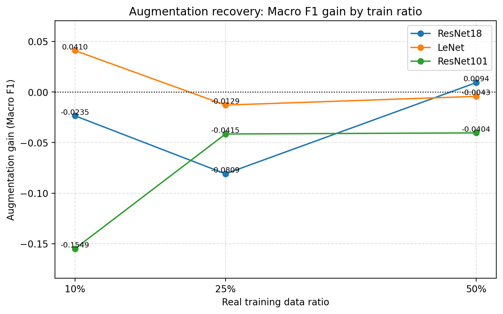

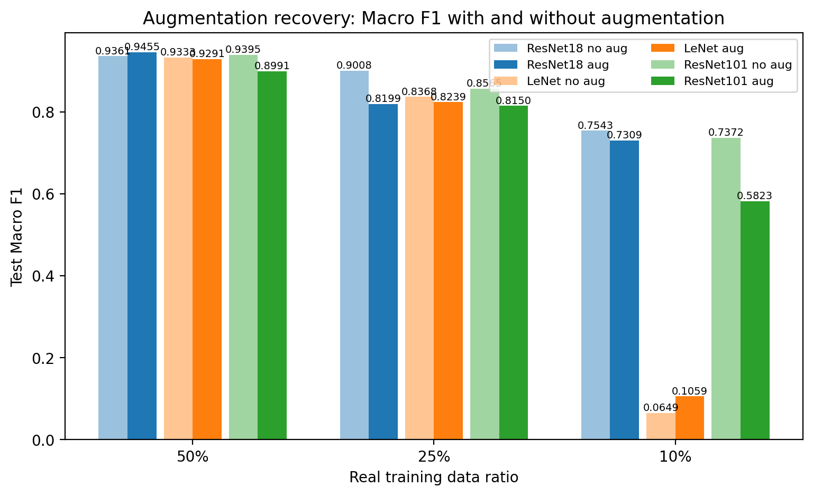

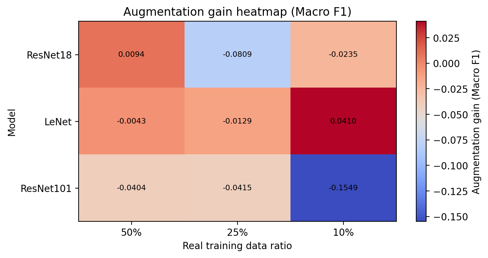

## 8. 종합 논의

본 연구는 Wi-Fi CSI HAR가 privacy-friendly한 고령자 돌봄 보조 기술로서 가능성이 있음을 보여준다. Camera 기반 시스템에 비해 직접적인 시각 정보 수집이 없고, 낙상이나 일상 행동 변화 탐지와 같은 응용 가능성을 가진다는 점은 분명한 장점이다. 그러나 실제 활용 가능성은 단순히 full-data benchmark 성능이 아니라 제한된 calibration data에서 얼마나 성능을 유지하는가에 더 크게 좌우된다.

이 관점에서 본 실험은 `ResNet18 + moving_average_smoothing+minmax_scaling` 조합이 유의미한 후보임을 시사한다. `real_ratio=0.25`에서도 test `Macro F1 = 0.9008`을 유지한 것은, 설치 후 비교적 적은 labeled data만으로도 usable한 수준의 activity recognition이 가능할 수 있음을 보여준다. 반면 `real_ratio=0.1`은 여전히 어려운 구간이며, 모델 간 격차가 크게 벌어졌다.

또한 단순 augmentation만으로 low-data 문제를 해결하기는 어렵다는 점도 확인되었다. 이는 Wi-Fi CSI 패턴이 환경 의존적이라는 특성 때문일 수 있다. 즉, 단순한 noise injection이나 masking만으로는 실제 공간 변화나 user-specific variation을 충분히 모사하지 못했을 가능성이 있다.

## 9. 한계점

본 연구의 한계는 다음과 같다.

1. `UT-HAR` benchmark setting이 실제 가정 환경을 완전히 대표한다고 보기는 어렵다.
2. sampling rate 기반 시간 환산은 illustrative estimate일 뿐이며, 실제 수집 시간의 엄밀한 측정이 아니다.
3. 데이터 분할은 benchmark split이며, 실제 household adaptation 시나리오를 직접 재현한 것은 아니다.
4. augmentation policy는 제한된 후보만 실험했으며, 더 물리적으로 타당한 augmentation은 아직 다루지 못했다.
5. Wi-Fi CSI는 환경 민감성이 높아 가구 배치, 벽 재질, device position, 사용자 체형 차이에 따라 성능이 달라질 수 있다.
6. 본 프로젝트는 실제 배치 실험이나 online adaptation을 포함하지 않는다.

## 10. 개선 방향

향후 개선 방향은 다음과 같다.

- **Better augmentation**: physically plausible CSI augmentation, domain-aware noise, room-layout-aware perturbation과 같이 실제 전파 변화에 더 가까운 augmentation 설계가 필요하다.
- **Few-shot / domain adaptation**: 새로운 집이나 새로운 공간에 대해 더 적은 labeled sample로 적응할 수 있는 방법이 중요하다.
- **Self-supervised pretraining**: labeling 이전의 unlabeled CSI를 활용해 representation을 먼저 학습하는 접근이 가능하다.
- **Environment probing**: speaker/room calibration system이 test signal로 acoustic response를 추정하듯, Wi-Fi CSI 시스템도 초기 probing을 통해 공간의 신호 특성을 추정할 수 있다.
- **Building / room metadata 활용**: room size, router location, wall/furniture layout, approximate Tx/Rx positions 같은 정보를 부가적으로 사용할 수 있다.
- **Multi-modal but privacy-aware sensing**: 필요 시 camera가 아닌 다른 비시각 센서와 결합하는 방향도 고려할 수 있다.
- **Personalization**: household 또는 user 단위의 최소 labeled data calibration 전략을 고도화할 필요가 있다.

## 11. 결론

본 프로젝트의 official F1-F5 workflow를 종합하면, 최종 전처리는 `moving_average_smoothing+minmax_scaling`으로 확정되었고, low-data robustness 측면에서 가장 실용적인 모델은 `ResNet18`으로 나타났다. 특히 `real_ratio=0.25`에서 test `Macro F1 = 0.9008`을 달성한 점은 제한된 학습 데이터에서도 상당한 수준의 성능 유지가 가능함을 보여준다.

반면 extreme low-data인 `real_ratio=0.1`에서는 여전히 난도가 높았고, model sensitivity 차이도 크게 나타났다. 또한 현재의 train-only augmentation policy는 성능 회복을 일관되게 보장하지 못했다. 따라서 향후 연구는 환경 적응성과 물리적으로 더 그럴듯한 augmentation, 그리고 few-shot/domain adaptation 방향에 집중할 필요가 있다.

## 참고 자료

- 통계청 장래인구추계
- 보건복지부 고독사 발생 실태조사
- `UT-HAR` / `WiFi-CSI-Sensing-Benchmark` repository
- 본 프로젝트의 official F1-F5 outputs
