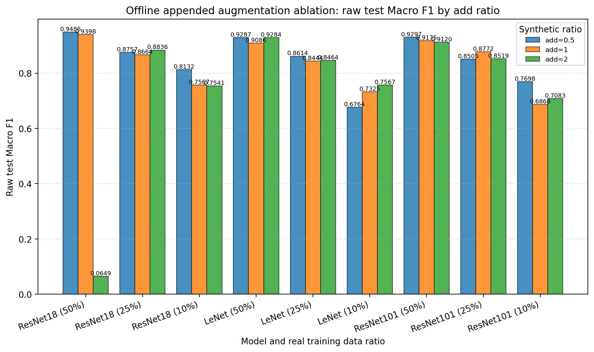
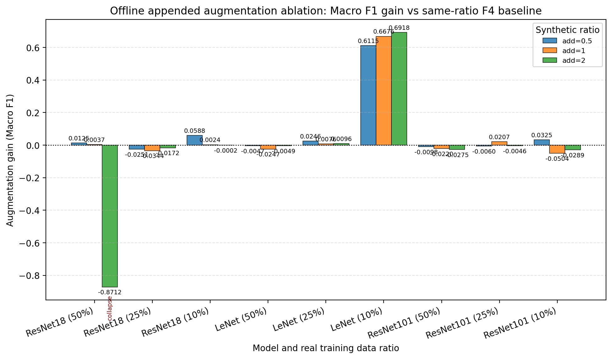
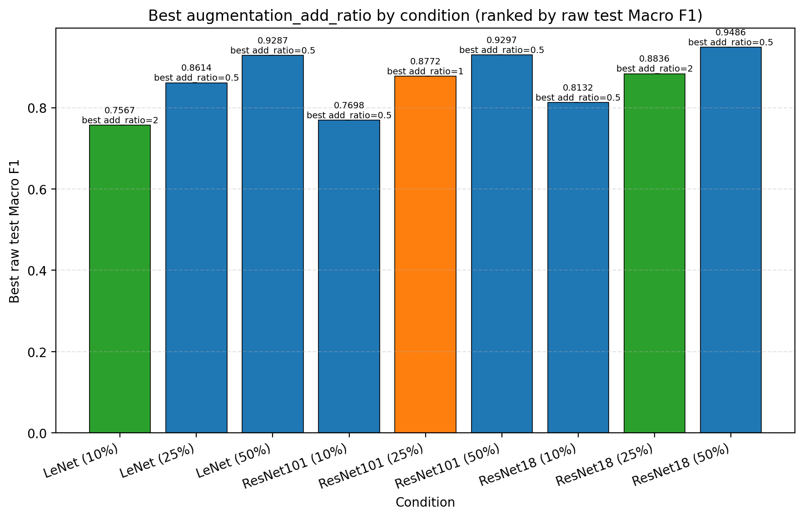
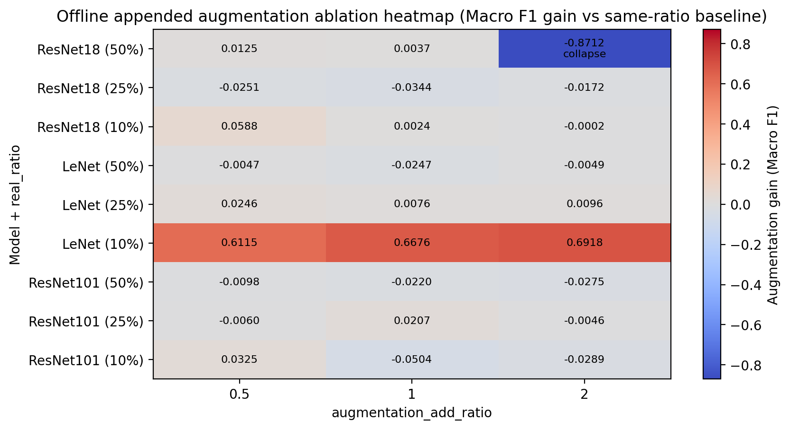
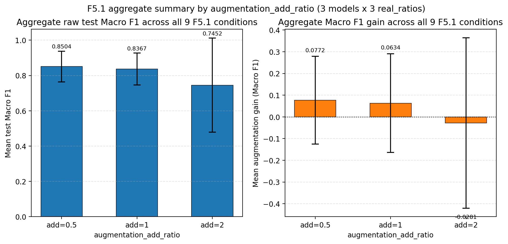
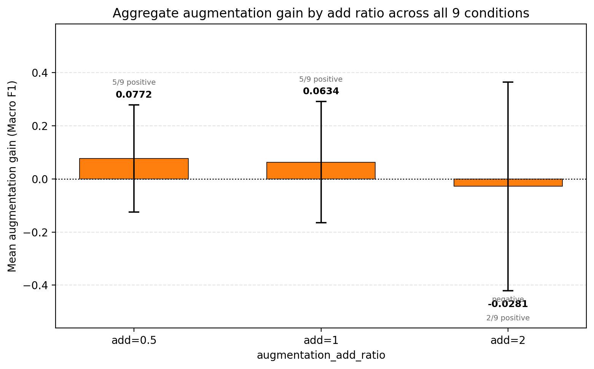
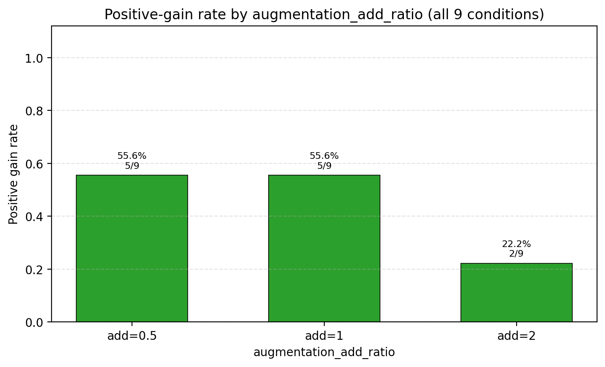
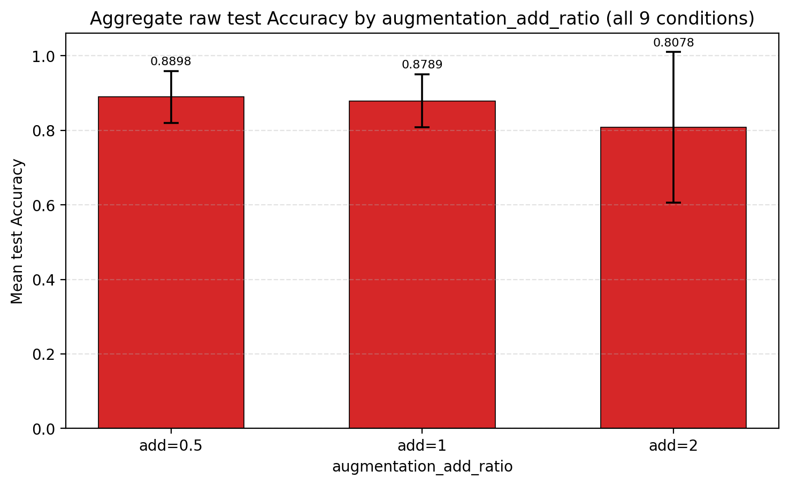

# Wi-Fi CSI HAR Workflow Status Report

This report reflects only the clean F1-F5.1 workflow status. Old prototype artifacts are not used as final evidence.

## Workflow Rules

- F1 uses `preprocessing=none/raw` and `training_mode=original_epoch`.
- F1 model selection uses validation `Macro F1`; test `Macro F1` is confirmation only.
- F2/F3/F4/F5/F5.1 use `training_mode=controlled_generalization`.
- F2 uses the benchmark rank 1 model from F1.
- F3 selects final preprocessing primarily by mean validation `Macro F1` across seeds.
- Test `Macro F1` is confirmation only for preprocessing selection.
- F4 uses benchmark top3 models by default.
- final report should use only official final workflow outputs.

## Current Official Status

- F1 benchmark completed: yes
- F2 preprocessing comparison completed: yes
- F3 multi-seed stability check completed: yes
- Final preprocessing selected: `moving_average_smoothing+minmax_scaling`
- F4 low-data robustness: completed
- F5 augmentation recovery: completed
- F5.1 augmentation add ratio ablation: completed


## Dataset and Labels

- dataset: `UT-HAR`
- array shape in this repo: `(N, 250, 90)`
- one sample = `250 CSI frame indices x 90 CSI features`
- activity labels: lie down, fall, walk, pickup, run, sit down, stand up
- timestep is `CSI frame index`, not directly seconds.
- if `sampling_rate = fs` Hz, one sample duration is `250 / fs` seconds.
- `100Hz` conversion is illustrative only and not confirmed ground truth.


## F1. Original Benchmark Full Run

- selection metric = validation Macro F1
- test Macro F1 is confirmation only

| rank | model | val_macro_f1 | test_macro_f1 | val_accuracy | test_accuracy | preprocessing | training_mode |
|---:|---|---:|---:|---:|---:|---|---|
| 1 | ResNet18 | 0.9906 | 0.9807 | 0.9940 | 0.9880 | none | original_epoch |
| 2 | LeNet | 0.9887 | 0.9672 | 0.9940 | 0.9780 | none | original_epoch |
| 3 | ResNet101 | 0.9776 | 0.9230 | 0.9819 | 0.9500 | none | original_epoch |
| 4 | ResNet50 | 0.9773 | 0.9640 | 0.9798 | 0.9760 | none | original_epoch |
| 5 | ViT | 0.9707 | 0.9175 | 0.9738 | 0.9400 | none | original_epoch |
| 6 | MLP | 0.9471 | 0.8925 | 0.9496 | 0.9120 | none | original_epoch |
| 7 | GRU | 0.9196 | 0.8739 | 0.9294 | 0.9060 | none | original_epoch |
| 8 | LSTM | 0.9164 | 0.8748 | 0.9274 | 0.9120 | none | original_epoch |
| 9 | BiLSTM | 0.9063 | 0.8716 | 0.9274 | 0.9040 | none | original_epoch |
| 10 | RNN | 0.7322 | 0.6715 | 0.7440 | 0.7020 | none | original_epoch |
| 11 | CNN+GRU | 0.1461 | 0.1611 | 0.3750 | 0.4100 | none | original_epoch |


Benchmark selection document:

- `docs/final_benchmark_selection.md` exists.

## F2. Preprocessing Comparison

- F2 compares preprocessing candidates with the F1 benchmark rank 1 model.
- Validation Macro F1 is the selection metric.
- Test Macro F1 is confirmation only.

### F2 Single-method Results

| rank | preprocessing | model | val_macro_f1 | test_macro_f1 | val_accuracy | test_accuracy |
|---:|---|---|---:|---:|---:|---:|
| 1 | train_featurewise_zscore | ResNet18 | 0.9358 | 0.8955 | 0.9516 | 0.9300 |
| 2 | robust_scaling | ResNet18 | 0.9262 | 0.8680 | 0.9415 | 0.9120 |
| 3 | train_global_zscore | ResNet18 | 0.9154 | 0.8689 | 0.9274 | 0.9140 |
| 4 | savgol_smoothing | ResNet18 | 0.9153 | 0.8739 | 0.9274 | 0.9140 |
| 5 | moving_average_smoothing | ResNet18 | 0.9150 | 0.8920 | 0.9355 | 0.9260 |
| 6 | minmax_scaling | ResNet18 | 0.9121 | 0.9083 | 0.9274 | 0.9360 |
| 7 | none | ResNet18 | 0.9097 | 0.8874 | 0.9254 | 0.9220 |
| 8 | per_sample_zscore | ResNet18 | 0.9054 | 0.8763 | 0.9133 | 0.9180 |
| 9 | per_sample_featurewise_zscore | ResNet18 | 0.4546 | 0.3970 | 0.5302 | 0.4920 |

- Best single-method candidate in F2 by validation Macro F1: `train_featurewise_zscore`
- Final preprocessing is not selected from F2 single results alone. F3 multi-seed stability check determines the final preprocessing.

### F2 Combination Preprocessing Results

| rank | preprocessing | model | val_macro_f1 | test_macro_f1 | val_accuracy | test_accuracy |
|---:|---|---|---:|---:|---:|---:|
| 1 | savgol_smoothing+train_global_zscore | ResNet18 | 0.9472 | 0.8513 | 0.9536 | 0.9060 |
| 2 | moving_average_smoothing+minmax_scaling | ResNet18 | 0.9445 | 0.9008 | 0.9516 | 0.9400 |
| 3 | savgol_smoothing+train_featurewise_zscore | ResNet18 | 0.9287 | 0.8847 | 0.9355 | 0.9180 |
| 4 | savgol_smoothing+minmax_scaling | ResNet18 | 0.9262 | 0.8913 | 0.9415 | 0.9220 |
| 5 | moving_average_smoothing+train_featurewise_zscore | ResNet18 | 0.9227 | 0.8859 | 0.9415 | 0.9280 |

- These top combination candidates were forwarded into the F3 multi-seed stability check.


- `docs/final_preprocessing_decision.md` exists.


## F3. Multi-seed Preprocessing Stability Check

- F3 was added because single-seed F2 showed close preprocessing candidates.
- Final selection is based on mean validation Macro F1 across seeds.
- Stability is used only as a meaningful tie-break.
- Test Macro F1 is confirmation only.

| rank | preprocessing | mean_val_macro_f1 | std_val_macro_f1 | mean_test_macro_f1 | std_test_macro_f1 | mean_val_test_macro_f1_gap | num_seeds |
|---:|---|---:|---:|---:|---:|---:|---:|
| 1 | moving_average_smoothing+minmax_scaling | 0.9268 | 0.0178 | 0.9118 | 0.0120 | 0.0150 | 3 |
| 2 | savgol_smoothing+train_global_zscore | 0.9258 | 0.0222 | 0.8990 | 0.0338 | 0.0268 | 3 |
| 3 | moving_average_smoothing | 0.9227 | 0.0174 | 0.9067 | 0.0209 | 0.0159 | 3 |
| 4 | train_featurewise_zscore | 0.9160 | 0.0359 | 0.8799 | 0.0243 | 0.0361 | 3 |
| 5 | minmax_scaling | 0.9111 | 0.0142 | 0.9003 | 0.0114 | 0.0108 | 3 |

### Final Preprocessing Decision

- final selected preprocessing = `moving_average_smoothing+minmax_scaling`
- model = `ResNet18`
- seeds = 42, 43, 44
- mean_val_macro_f1 = 0.9268
- std_val_macro_f1 = 0.0178
- mean_test_macro_f1 = 0.9118
- std_test_macro_f1 = 0.0120

- `docs/final_preprocessing_decision.md` exists and records the official final preprocessing decision.


## F4. Low-data Robustness

| model | real_ratio | test_macro_f1 | test_accuracy | macro_f1_drop | macro_f1_retention | accuracy_drop | accuracy_retention |
|---|---:|---:|---:|---:|---:|---:|---:|
| LeNet | 1.0000 | 0.9621 | 0.9740 | 0.0000 | 1.0000 | 0.0000 | 1.0000 |
| LeNet | 0.5000 | 0.9333 | 0.9540 | 0.0288 | 0.9701 | 0.0200 | 0.9795 |
| LeNet | 0.2500 | 0.8368 | 0.8840 | 0.1253 | 0.8698 | 0.0900 | 0.9076 |
| LeNet | 0.1000 | 0.0649 | 0.2940 | 0.8972 | 0.0675 | 0.6800 | 0.3018 |
| ResNet101 | 1.0000 | 0.9763 | 0.9800 | 0.0000 | 1.0000 | 0.0000 | 1.0000 |
| ResNet101 | 0.5000 | 0.9395 | 0.9560 | 0.0367 | 0.9624 | 0.0240 | 0.9755 |
| ResNet101 | 0.2500 | 0.8565 | 0.8980 | 0.1198 | 0.8773 | 0.0820 | 0.9163 |
| ResNet101 | 0.1000 | 0.7372 | 0.8060 | 0.2391 | 0.7551 | 0.1740 | 0.8224 |
| ResNet18 | 1.0000 | 0.9629 | 0.9740 | 0.0000 | 1.0000 | 0.0000 | 1.0000 |
| ResNet18 | 0.5000 | 0.9361 | 0.9600 | 0.0268 | 0.9722 | 0.0140 | 0.9856 |
| ResNet18 | 0.2500 | 0.9008 | 0.9400 | 0.0621 | 0.9355 | 0.0340 | 0.9651 |
| ResNet18 | 0.1000 | 0.7543 | 0.8160 | 0.2085 | 0.7834 | 0.1580 | 0.8378 |

### F4 Interpretation

- At 25% training data, the strongest model by test Macro F1 is `ResNet18` (0.9008).
- At 10% training data, the strongest model by test Macro F1 is `ResNet18` (0.7543).
- `LeNet` collapses sharply at 10%, with test Macro F1 dropping to 0.0649.
- At 50% training data, all benchmark top3 models remain relatively stable.
- At 25%, model differences become clearer.
- At 10%, the best Macro F1 retention belongs to `ResNet18` (0.7834).
- The raw Macro F1 figure and the retention figure should be read differently: raw Macro F1 shows actual performance, while retention is normalized to each model's own 100% baseline.
- In the retention plot, 100% training data appears as 1.0 by definition because each model is divided by its own full-data result.


## F5. Augmentation Recovery

- This official F5 design uses offline appended synthetic samples, not on-the-fly augmentation.
- Synthetic samples are generated only from the selected real train subset. Validation/test are never augmented.

| model | real_ratio | selected_real_train_size | synthetic_train_size | effective_train_size | augmentation_add_ratio | no_aug_test_macro_f1 | test_macro_f1 | no_aug_test_accuracy | test_accuracy | augmentation_gain_macro_f1 | augmentation_gain_accuracy |
|---|---:|---:|---:|---:|---:|---:|---:|---:|---:|---:|---:|
| LeNet | 0.5000 | 1987 | 1987 | 3974 | 1.0000 | 0.9333 | 0.9086 | 0.9540 | 0.9380 | -0.0247 | -0.0160 |
| LeNet | 0.2500 | 992 | 992 | 1984 | 1.0000 | 0.8368 | 0.8444 | 0.8840 | 0.8840 | 0.0076 | 0.0000 |
| LeNet | 0.1000 | 395 | 395 | 790 | 1.0000 | 0.0649 | 0.7325 | 0.2940 | 0.7940 | 0.6676 | 0.5000 |
| ResNet101 | 0.5000 | 1987 | 1987 | 3974 | 1.0000 | 0.9395 | 0.9175 | 0.9560 | 0.9420 | -0.0220 | -0.0140 |
| ResNet101 | 0.2500 | 992 | 992 | 1984 | 1.0000 | 0.8565 | 0.8772 | 0.8980 | 0.9100 | 0.0207 | 0.0120 |
| ResNet101 | 0.1000 | 395 | 395 | 790 | 1.0000 | 0.7372 | 0.6868 | 0.8060 | 0.7600 | -0.0504 | -0.0460 |
| ResNet18 | 0.5000 | 1987 | 1987 | 3974 | 1.0000 | 0.9361 | 0.9398 | 0.9600 | 0.9600 | 0.0037 | 0.0000 |
| ResNet18 | 0.2500 | 992 | 992 | 1984 | 1.0000 | 0.9008 | 0.8664 | 0.9400 | 0.9040 | -0.0344 | -0.0360 |
| ResNet18 | 0.1000 | 395 | 395 | 790 | 1.0000 | 0.7543 | 0.7567 | 0.8160 | 0.8180 | 0.0024 | 0.0020 |

### F5 Interpretation

- F5 evaluates offline appended synthetic augmentation against the F4 no-augmentation baseline.
- Synthetic samples are generated only from the selected train subset. Validation/test are never augmented.
- Positive Macro F1 gain rows: 5; negative rows: 4; zero rows: 0.
- Largest positive Macro F1 gain: `LeNet` at `real_ratio=0.1` (0.6676).
- Largest negative Macro F1 gain: `ResNet101` at `real_ratio=0.1` (-0.0504).
- This is not a clear augmentation success.
- This is a limited and condition-dependent result.
- The current offline_append augmentation shows partial recovery in some weak or collapsed low-data conditions, but it does not generalize as a robust universal fix for CSI HAR.
- `LeNet` at `real_ratio=0.1` improves strongly, but this should be interpreted as recovery from a collapsed baseline rather than universal superiority.
- By contrast, `ResNet18`, the most practical low-data model in F4, benefits only marginally at `0.5` and `0.1` and worsens at `0.25`, showing that augmentation does not reliably help already robust models.


## F5.1 Augmentation Add Ratio Ablation

- This ablation compares augmentation_add_ratio=0.5, 1.0, 2.0 under the same offline_append design.
- It reuses the official final preprocessing: `moving_average_smoothing+minmax_scaling`.
- It uses benchmark top3 models: `ResNet18`, `LeNet`, `ResNet101`.
- It keeps the same real-ratio settings: `0.5`, `0.25`, `0.1`.
- Each augmented result is compared only against the F4 no-augmentation baseline with the same model, same real_ratio, and same preprocessing.
- `augmentation_add_ratio=1.0` rows come from the completed official F5 run when `source=reused_final_f5`.
- `augmentation_add_ratio=0.5` and `2.0` rows are ablation-specific runs when `source=trained_ablation`.

| model | real_ratio | augmentation_add_ratio | selected_real_train_size | synthetic_train_size | effective_train_size | no_aug_test_macro_f1 | test_macro_f1 | augmentation_gain_macro_f1 | source |
|---|---:|---:|---:|---:|---:|---:|---:|---:|---|
| LeNet | 0.5000 | 0.5000 | 1987 | 992 | 2979 | 0.9333 | 0.9287 | -0.0047 | trained_ablation |
| LeNet | 0.5000 | 1.0000 | 1987 | 1987 | 3974 | 0.9333 | 0.9086 | -0.0247 | reused_final_f5 |
| LeNet | 0.5000 | 2.0000 | 1987 | 3974 | 5961 | 0.9333 | 0.9284 | -0.0049 | trained_ablation |
| LeNet | 0.2500 | 0.5000 | 992 | 494 | 1486 | 0.8368 | 0.8614 | 0.0246 | trained_ablation |
| LeNet | 0.2500 | 1.0000 | 992 | 992 | 1984 | 0.8368 | 0.8444 | 0.0076 | reused_final_f5 |
| LeNet | 0.2500 | 2.0000 | 992 | 1984 | 2976 | 0.8368 | 0.8464 | 0.0096 | trained_ablation |
| LeNet | 0.1000 | 0.5000 | 395 | 196 | 591 | 0.0649 | 0.6764 | 0.6115 | trained_ablation |
| LeNet | 0.1000 | 1.0000 | 395 | 395 | 790 | 0.0649 | 0.7325 | 0.6676 | reused_final_f5 |
| LeNet | 0.1000 | 2.0000 | 395 | 790 | 1185 | 0.0649 | 0.7567 | 0.6918 | trained_ablation |
| ResNet101 | 0.5000 | 0.5000 | 1987 | 992 | 2979 | 0.9395 | 0.9297 | -0.0098 | trained_ablation |
| ResNet101 | 0.5000 | 1.0000 | 1987 | 1987 | 3974 | 0.9395 | 0.9175 | -0.0220 | reused_final_f5 |
| ResNet101 | 0.5000 | 2.0000 | 1987 | 3974 | 5961 | 0.9395 | 0.9120 | -0.0275 | trained_ablation |
| ResNet101 | 0.2500 | 0.5000 | 992 | 494 | 1486 | 0.8565 | 0.8505 | -0.0060 | trained_ablation |
| ResNet101 | 0.2500 | 1.0000 | 992 | 992 | 1984 | 0.8565 | 0.8772 | 0.0207 | reused_final_f5 |
| ResNet101 | 0.2500 | 2.0000 | 992 | 1984 | 2976 | 0.8565 | 0.8519 | -0.0046 | trained_ablation |
| ResNet101 | 0.1000 | 0.5000 | 395 | 196 | 591 | 0.7372 | 0.7698 | 0.0325 | trained_ablation |
| ResNet101 | 0.1000 | 1.0000 | 395 | 395 | 790 | 0.7372 | 0.6868 | -0.0504 | reused_final_f5 |
| ResNet101 | 0.1000 | 2.0000 | 395 | 790 | 1185 | 0.7372 | 0.7083 | -0.0289 | trained_ablation |
| ResNet18 | 0.5000 | 0.5000 | 1987 | 992 | 2979 | 0.9361 | 0.9486 | 0.0125 | trained_ablation |
| ResNet18 | 0.5000 | 1.0000 | 1987 | 1987 | 3974 | 0.9361 | 0.9398 | 0.0037 | reused_final_f5 |
| ResNet18 | 0.5000 | 2.0000 | 1987 | 3974 | 5961 | 0.9361 | 0.0649 | -0.8712 | trained_ablation |
| ResNet18 | 0.2500 | 0.5000 | 992 | 494 | 1486 | 0.9008 | 0.8757 | -0.0251 | trained_ablation |
| ResNet18 | 0.2500 | 1.0000 | 992 | 992 | 1984 | 0.9008 | 0.8664 | -0.0344 | reused_final_f5 |
| ResNet18 | 0.2500 | 2.0000 | 992 | 1984 | 2976 | 0.9008 | 0.8836 | -0.0172 | trained_ablation |
| ResNet18 | 0.1000 | 0.5000 | 395 | 196 | 591 | 0.7543 | 0.8132 | 0.0588 | trained_ablation |
| ResNet18 | 0.1000 | 1.0000 | 395 | 395 | 790 | 0.7543 | 0.7567 | 0.0024 | reused_final_f5 |
| ResNet18 | 0.1000 | 2.0000 | 395 | 790 | 1185 | 0.7543 | 0.7541 | -0.0002 | trained_ablation |

### F5.1 Interpretation

- augmentation_add_ratio=0.5: positive 5, negative 4, zero 0.
- augmentation_add_ratio=1: positive 5, negative 4, zero 0.
- augmentation_add_ratio=2: positive 2, negative 7, zero 0.
- Mean augmentation_gain_macro_f1 at augmentation_add_ratio=0.5: 0.0772.
- Mean augmentation_gain_macro_f1 at augmentation_add_ratio=1: 0.0634.
- Mean augmentation_gain_macro_f1 at augmentation_add_ratio=2: -0.0281.
- Mean test_macro_f1 at augmentation_add_ratio=0.5: 0.8504.
- Mean test_macro_f1 at augmentation_add_ratio=1: 0.8367.
- Mean test_macro_f1 at augmentation_add_ratio=2: 0.7452.
- Best augmentation_add_ratio by condition: LeNet@0.1->2, LeNet@0.25->0.5, LeNet@0.5->0.5, ResNet101@0.1->0.5, ResNet101@0.25->1, ResNet101@0.5->0.5, ResNet18@0.1->0.5, ResNet18@0.25->2, ResNet18@0.5->0.5.
- augmentation_add_ratio=0.5 is most often best across model/ratio conditions.
- The most stable average gain appears at augmentation_add_ratio=0.5, while augmentation_add_ratio=2 is weakest on average.
- Severe collapse case: `ResNet18` at `real_ratio=0.5` with augmentation_add_ratio=2 drops to test_macro_f1=0.0649.
- Synthetic data is not simply the more the better; augmentation strength should be tuned by model and real_ratio.










### F5.1 Aggregate Summary by augmentation_add_ratio

- This aggregate layer groups only by `augmentation_add_ratio` and summarizes the full 3 models x 3 real_ratios grid.
- Each row below aggregates across up to 9 condition rows from the official F5.1 CSV.

| augmentation_add_ratio | n_conditions | mean_test_macro_f1 | std_test_macro_f1 | mean_augmentation_gain_macro_f1 | std_augmentation_gain_macro_f1 | positive_gain_rate | positive_gain_count | source mix |
|---:|---:|---:|---:|---:|---:|---:|---:|---|
| 0.5000 | 9 | 0.8504 | 0.0873 | 0.0772 | 0.2020 | 55.6% | 5 | reused=0, trained=9, existing=0 |
| 1.0000 | 9 | 0.8367 | 0.0899 | 0.0634 | 0.2277 | 55.6% | 5 | reused=9, trained=0, existing=0 |
| 2.0000 | 9 | 0.7452 | 0.2661 | -0.0281 | 0.3925 | 22.2% | 2 | reused=0, trained=9, existing=0 |

### F5.1 Aggregate Interpretation

- These aggregate statistics collapse the full F5.1 grid into three augmentation_add_ratio groups, each covering up to 9 model/real_ratio conditions.
- Highest mean_test_macro_f1: augmentation_add_ratio=0.5 (0.8504).
- Highest mean_augmentation_gain_macro_f1: augmentation_add_ratio=0.5 (0.0772).
- Best positive_gain_rate: augmentation_add_ratio=0.5 (55.6%, 5/9).
- This should not be read as a clear augmentation success. The aggregate view shows limited and condition-dependent benefit rather than a robust universal fix.
- augmentation_add_ratio=0.5 is the most stable aggregate choice: it has the highest mean test Macro F1, the highest mean Macro F1 gain, and it ties for the best positive-gain rate.
- augmentation_add_ratio=1.0 is partially useful, but it is not the aggregate best and it improves only 5 of 9 conditions, the same positive-gain count as 0.5.
- Higher synthetic ratio is not consistently better. The aggregate summary shows that augmentation_add_ratio=2.0 has the weakest average gain and the highest instability, indicating that over-augmentation can harm robustness.
- The most unstable aggregate setting is augmentation_add_ratio=2 (std_augmentation_gain_macro_f1=0.3925).
- Positive-gain rate is only 5/9 for both 0.5 and 1.0, so even the better settings should be interpreted as partial recovery, not broad success.
- The negative result is informative: simple offline_append synthetic augmentation can help some weak or collapsed conditions, but it does not generalize as a consistently reliable solution for CSI HAR low-data robustness.
- Even the best aggregate setting remains modest: augmentation_add_ratio=0.5 reaches mean_augmentation_gain_macro_f1 = `+0.0772`, but the standard deviation is large, so condition-level variance remains substantial.
- This is better interpreted as an early sign of possible recovery in selected cases than as evidence that augmentation stably solves the low-data problem.
- A likely reason is that CSI is not image-like data. Naive synthetic transforms may fail to preserve physically meaningful channel structure, and too much synthetic data can distort the training distribution.
- CSI contains coupled structure across time, subcarriers, and antenna-pair channels, so simple noise/masking/shift/scaling transforms may not preserve the physically meaningful signal structure that defines HAR conditions.
- Applying the same augmentation policy to all classes is also a limitation: behavior classes differ in duration, movement speed, repetition, and posture-change pattern, so class-conditional augmentation may be necessary.
- The model dependence is equally important: models that collapse easily in low-data settings may recover from synthetic samples, but already robust models may not gain consistent benefit. This points to model-specific augmentation strength as a future requirement.
- Future work should prioritize physics-aware augmentation, class-conditional augmentation, model-specific augmentation strength, and signal-structure-aware or environment-aware synthetic generation.



<table><tr><td align="center" valign="top" width="33%"><br><sub>Aggregate F5.1 Macro F1 gain by augmentation_add_ratio</sub></td><td align="center" valign="top" width="33%"><br><sub>Aggregate F5.1 positive-gain rate by augmentation_add_ratio</sub></td><td align="center" valign="top" width="33%"><br><sub>Aggregate F5.1 raw test Accuracy by augmentation_add_ratio</sub></td></tr></table>


## F6. Final Report

F6 final report can now be generated from the official F1-F5.1 outputs. Test-set figures and tables above should be reused as final evidence.

## Next Step

F5.1 is complete, so the next step is final report regeneration and packaging from the official F1-F5.1 outputs.

Command:

```powershell
python experiments/09_build_preliminary_report.py
```

